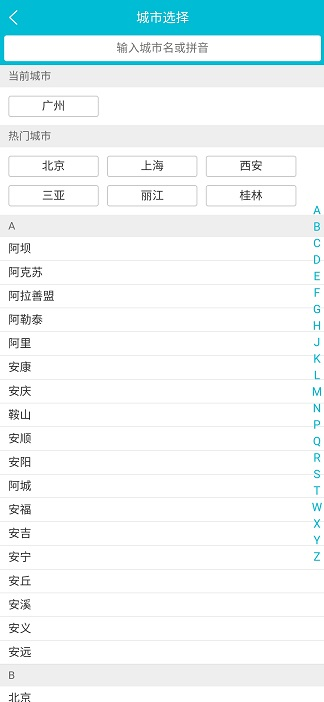

# Travel

> A Vue.js project

**仿去哪儿核心页面**			     **前端开发**

⚫ 描述：使用Vue.js开发的仿去哪儿核心页面（首页、城市选择页、详情页）

⚫ 预览链接：[https://hcq29.github.io/Travel/dist/](https://hcq29.github.io/Travel/dist/)  （查看时请缩小网页，或者使用手机预览）

1. 负责公共头部、轮播图的开发，同时使用 `axios` 获取接口数据以及父子组件间数据的传递；

2. 在城市选择页面中使用了路由配置、 `Better-scroll `、字母表布局技术，支持城市搜索；

3. 采用 `Vuex` 实现数据共享， `LocalStorage` 实现页面数据持久存储及 `keep-alive` 优化路由页面性能；

4. 使用动态路由配置完成详情页面的开发以及动画效果的封装。

以下是预览图片

- 首页

-   .jpg) 

- 城市选择页面

 

- 详情页面

   